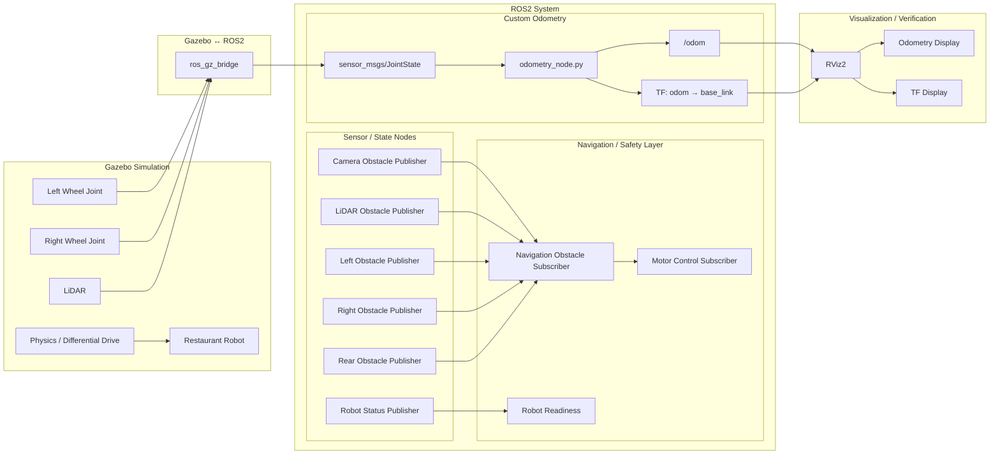

# ROS2 Restaurant Delivery Robot

A research-oriented autonomous mobile robot project built as part of my long-term robotics learning and graduate research preparation.

The purpose of this project is not only to make a robot move in simulation. I am using the project to understand what happens underneath autonomous navigation: sensing, coordinate frames, differential-drive motion, odometry, localization, planning, safety, uncertainty and eventually human-aware navigation.

---

## Project Goal

I am building a restaurant delivery robot using ROS2 and Gazebo while implementing important robotics concepts myself before depending heavily on ready-made navigation packages.

The project is developing progressively:

```text
Robot Model
    ↓
Sensors
    ↓
Robot State
    ↓
Motion
    ↓
Wheel Measurements
    ↓
Odometry
    ↓
TF / Coordinate Frames
    ↓
Localization
    ↓
Mapping
    ↓
Path Planning
    ↓
Autonomous Navigation
```

My longer-term research direction is autonomous mobile robotics and navigation in dynamic human environments such as restaurants.

---

# System Architecture



---

## Architecture Explanation

The current robot system can be viewed as several connected layers:

```text
Gazebo Simulation
        ↓
Gazebo ↔ ROS2 Bridge
        ↓
ROS2 Sensors / State
        ↓
Navigation + Custom Odometry
        ↓
TF + /odom
        ↓
RViz Verification
```

### Gazebo

Gazebo provides the simulated physical robot and environment.

The simulation currently includes:

- differential-drive robot motion
- left and right wheel joints
- robot physics
- LiDAR sensing
- collision geometry
- obstacles
- simulated restaurant-style environment development

### Gazebo ↔ ROS2

`ros_gz_bridge` transfers relevant simulation data into ROS2.

For the custom odometry system, the important path is:

```text
Gazebo wheel joints
        ↓
JointStatePublisher
        ↓
ros_gz_bridge
        ↓
sensor_msgs/JointState
        ↓
odometry_node.py
```

### ROS2 Sensor and Navigation Nodes

The project also contains ROS2 nodes for:

- obstacle information
- robot status
- sensor-state monitoring
- navigation decisions
- motor-control logic
- robot-readiness logic

The navigation architecture is intentionally being developed from fundamentals before integrating a complete navigation framework.

### Custom Odometry

The odometry node converts wheel motion into robot motion:

```text
wheel angle change
        ↓
wheel displacement
        ↓
robot translation / rotation
        ↓
x / y / theta
        ↓
linear velocity / angular velocity
```

It produces:

```text
nav_msgs/Odometry
        ↓
/odom
```

and:

```text
TF
odom → base_link
```

### RViz

RViz is used to verify both outputs:

```text
/odom
   ↓
Odometry Display
```

and:

```text
odom → base_link
       ↓
TF Display
```

The latest `/odom` pose and the `base_link` TF were visually verified to agree while the robot moved.

---

# Current Project Status

## Completed

- ROS2 publisher/subscriber fundamentals
- Multi-sensor obstacle information
- Robot-status communication
- Safety logic for missing or stale sensor information
- Navigation decision logic
- Gazebo robot simulation
- LiDAR integration in Gazebo
- Differential-drive robot motion
- Wheel joint-state publishing
- Gazebo-to-ROS2 JointState bridge
- Custom differential-drive odometry
- `x`, `y`, `theta` pose estimation
- Linear velocity estimation
- Angular velocity estimation
- `/odom` publishing using `nav_msgs/Odometry`
- Quaternion orientation generation
- Dynamic `odom -> base_link` TF broadcasting
- TF verification using `tf2_echo`
- RViz odometry visualization
- Verification that `/odom` and TF describe the same estimated pose
- C++ robotics decision-logic exercises

---

# Latest Milestone

## Custom Differential-Drive Odometry

Instead of depending only on automatically generated odometry, I implemented my own ROS2 differential-drive odometry node using wheel joint measurements.

The complete pipeline is:

```text
Gazebo Wheel Joints
        ↓
sensor_msgs/JointState
        ↓
Left / Right Wheel Angles
        ↓
ΔφL / ΔφR
        ↓
Wheel Displacement
        ↓
ΔsL / ΔsR
        ↓
Robot Translation + Rotation
        ↓
Δs / Δθ
        ↓
x / y / theta
        ↓
Δt
        ↓
Linear Velocity / Angular Velocity
        ↓
nav_msgs/Odometry
        ↓
/odom
        ↓
odom → base_link TF
        ↓
RViz
```

The implementation was tested using:

- straight motion
- backward motion
- in-place rotation
- curved motion
- positive angular velocity
- negative angular velocity

The calculated velocity was also checked against the commanded motion.

Example:

```text
Commanded:

linear velocity ≈ 0.20 m/s
angular velocity ≈ 0.30 rad/s

Custom Odometry:

linear.x ≈ 0.20 m/s
angular.z ≈ 0.30 rad/s
```

The `/odom` pose and `odom -> base_link` TF were then visualized together in RViz and verified to agree while the robot moved.

---

# Odometry Mathematics

## Wheel Displacement

```text
ΔsL = r × ΔφL
ΔsR = r × ΔφR
```

Where:

```text
r = wheel radius
Δφ = change in wheel angle
```

---

## Robot Center Displacement

```text
Δs = (ΔsR + ΔsL) / 2
```

---

## Orientation Change

```text
Δθ = (ΔsR - ΔsL) / wheel_separation
```

---

## Midpoint Heading

For a small curved movement:

```text
θmid = θ + Δθ / 2
```

---

## Position Update

```text
Δx = Δs × cos(θmid)
Δy = Δs × sin(θmid)
```

Then:

```text
x = x + Δx
y = y + Δy
θ = θ + Δθ
```

---

## Velocity

```text
v = Δs / Δt
```

and:

```text
ω = Δθ / Δt
```

Where:

```text
v = linear velocity
ω = angular velocity
```

This implementation helped me understand how wheel rotation becomes estimated robot motion instead of treating odometry as a black box.

---

# Coordinate Frames

The current odometry system uses:

```text
odom
  ↓
base_link
```

## `odom`

`odom` is a locally fixed reference frame used for smooth short-term robot motion estimation.

Wheel odometry can accumulate drift over time.

## `base_link`

`base_link` is attached to the robot body.

The positive x-axis of `base_link` represents the robot's forward direction.

The future navigation frame structure will develop toward:

```text
map
 ↓
odom
 ↓
base_link
```

The `map` frame can later provide a globally corrected reference while `odom` continues to provide smooth local motion.

---

# Key ROS2 Code

## Custom Odometry

[`odometry_node.py`](ros2_ws/src/restaurant_robot_status/restaurant_robot_status/odometry_node.py)

Responsibilities:

```text
JointState
→ wheel-angle change
→ wheel distance
→ robot displacement
→ x / y / theta
→ velocity
→ /odom
→ TF
```

---

## Navigation Decision Node

[`navigation_obstacle_subscriber.py`](ros2_ws/src/restaurant_robot_status/restaurant_robot_status/navigation_obstacle_subscriber.py)

Receives obstacle and sensor-state information and decides how the robot should react.

---

## Motor Control Subscriber

[`motor_control_subscriber.py`](ros2_ws/src/restaurant_robot_status/restaurant_robot_status/motor_control_subscriber.py)

Represents the stage where navigation decisions are converted toward robot movement commands.

---

## LiDAR Obstacle Publisher

[`lidar_obstacle_publisher.py`](ros2_ws/src/restaurant_robot_status/restaurant_robot_status/lidar_obstacle_publisher.py)

Used during the development of LiDAR-related obstacle information and ROS2 communication.

---

## Camera Obstacle Publisher

[`camera_obstacle_publisher.py`](ros2_ws/src/restaurant_robot_status/restaurant_robot_status/camera_obstacle_publisher.py)

Part of the multi-sensor obstacle-information architecture.

---

## Left Obstacle Publisher

[`left_obstacle_publisher.py`](ros2_ws/src/restaurant_robot_status/restaurant_robot_status/left_obstacle_publisher.py)

Provides information about the left side of the robot.

---

## Right Obstacle Publisher

[`right_obstacle_publisher.py`](ros2_ws/src/restaurant_robot_status/restaurant_robot_status/right_obstacle_publisher.py)

Provides information about the right side of the robot.

---

## Rear Obstacle Publisher

[`rear_obstacle_publisher.py`](ros2_ws/src/restaurant_robot_status/restaurant_robot_status/rear_obstacle_publisher.py)

Provides information about obstacles behind the robot.

---

## Robot Status

[`robot_status_publisher.py`](ros2_ws/src/restaurant_robot_status/restaurant_robot_status/robot_status_publisher.py)

Used for publishing robot-state information.

---

# Robot Description and Simulation

The robot description package is located in:

```text
ros2_ws/src/restaurant_robot_description/
```

Important files include:

### Robot SDF

[`restaurant_robot.sdf`](ros2_ws/src/restaurant_robot_description/models/restaurant_robot.sdf)

### Robot URDF

[`restaurant_robot.urdf`](ros2_ws/src/restaurant_robot_description/urdf/restaurant_robot.urdf)

### Gazebo World

[`restaurant_world.sdf`](ros2_ws/src/restaurant_robot_description/worlds/restaurant_world.sdf)

The simulation currently contains:

- robot base
- left wheel
- right wheel
- caster support
- LiDAR
- collision geometry
- differential-drive plugin
- wheel JointState publishing
- Gazebo world and obstacles

---

# ROS2 Odometry Data Flow

```text
Gazebo
  │
  ├── Left Wheel Joint
  │
  └── Right Wheel Joint
  │
  ↓
JointStatePublisher
  │
  ↓
ros_gz_bridge
  │
  ↓
sensor_msgs/JointState
  │
  ↓
odometry_node.py
  │
  ├───────────────┐
  ↓               ↓
/odom             TF
                  │
                  ↓
           odom → base_link
  │               │
  └───────┬───────┘
          ↓
        RViz
```

---

# Odometry Output

The custom node publishes:

```text
/odom
```

using:

```text
nav_msgs/Odometry
```

The message contains two important groups of information.

## Pose

```text
position
orientation
```

This answers:

> Where does the robot estimate that it is?

## Twist

```text
linear velocity
angular velocity
```

This answers:

> How does the robot estimate that it is moving?

---

# TF Output

The same estimated:

```text
x
y
theta
```

values are also used to broadcast:

```text
odom → base_link
```

This allows other ROS2 components to ask:

> Where is the robot frame relative to the odom frame?

The transform was verified using:

```bash
ros2 run tf2_ros tf2_echo odom base_link
```

---

# RViz Verification

RViz was configured with:

```text
Fixed Frame = odom
```

Displays:

```text
TF
Odometry
```

Odometry topic:

```text
/odom
```

For direct verification:

```text
Odometry Keep = 1
TF Show Names = ON
TF Show Axes = ON
```

The latest `/odom` arrow was checked against the `base_link` TF.

The two remained aligned while the robot moved.

This verified:

```text
/odom pose
≈
odom → base_link TF pose
```

because both outputs were generated from the same estimated:

```text
x
y
theta
```

---

# Safety Philosophy

One of the main lessons from this project is that uncertainty in robotics must be treated carefully.

If important sensor information is missing or stale, the robot should not simply assume that the path is safe.

Earlier experiments therefore included states such as:

```text
SENSOR_STALE
STOP
MOVE_FORWARD
TURN_LEFT
AVOIDING_OBSTACLE
```

The principle is:

```text
unknown information
        ↓
do not automatically assume safe
```

This safety-first approach will remain important as the system becomes more autonomous.

---

# Current Limitations

The project is still under active development.

The current wheel odometry can accumulate error because of:

- wheel slip
- collisions
- inaccurate wheel radius
- inaccurate wheel separation
- uneven surfaces
- wheel wear
- encoder or joint measurement error
- numerical approximation

Therefore:

```text
odometry estimate ≠ guaranteed ground truth
```

The robot currently has a motion estimate.

It does not yet have complete global localization.

---

# Next Experimental Stage

The next important step is to measure odometry error instead of only checking that the odometry system works.

The main comparison will be:

```text
Custom Wheel Odometry
        vs
Gazebo Ground Truth
```

Possible experiments include:

## Experiment 1 — Straight Motion

Measure:

```text
estimated distance
vs
actual simulated distance
```

---

## Experiment 2 — Curved Motion

Compare:

```text
estimated trajectory
vs
actual trajectory
```

---

## Experiment 3 — Wheel Slip

Investigate a situation where:

```text
wheel rotates
```

but:

```text
robot body does not move the expected distance
```

This demonstrates why wheel odometry alone cannot always be trusted.

---

## Experiment 4 — Incorrect Wheel Radius

Intentionally use an incorrect wheel-radius parameter and measure how the error accumulates.

---

## Experiment 5 — Incorrect Wheel Separation

Change the wheel-separation parameter and investigate the effect on estimated orientation.

---

The goal is to move from:

```text
"It works."
```

toward questions such as:

```text
How accurate is it?

How quickly does the error grow?

What causes the error?

Is the error systematic or random?

How could another sensor correct it?
```

This is the transition from implementation toward robotics experimentation and research thinking.

---

# Future Development

The planned technical progression is:

```text
Custom Odometry
      ↓
Ground-Truth Comparison
      ↓
Odometry Error Analysis
      ↓
Localization
      ↓
Probability / Uncertainty
      ↓
Sensor Fusion
      ↓
SLAM
      ↓
Occupancy Grid
      ↓
Path Planning
      ↓
Nav2
      ↓
Dynamic Obstacle Handling
      ↓
Human-Aware Navigation
```

---

# Research Direction

My main current interest is:

**Autonomous Mobile Robotics and Navigation**

Future topics I want to investigate include:

- localization
- SLAM
- sensor fusion
- navigation under uncertainty
- path planning
- dynamic obstacle avoidance
- human-aware navigation
- autonomous robots for restaurants and service environments

Restaurant environments are especially interesting because they contain:

```text
people
moving obstacles
tables and chairs
tight spaces
changing layouts
slippery surfaces
sensor uncertainty
safety requirements
```

These conditions create practical robotics problems that can later become research questions.

---

# Learning Evidence

Detailed technical notes are stored in:

[`learning-log/2026`](../../learning-log/2026)

The learning log records:

- concepts learned
- mathematics
- implementation work
- debugging
- experiments
- mistakes
- observations
- technical checkpoints

The day numbers are **not intended to represent a mandatory GitHub upload every calendar day**.

I only create and publish a learning note when I reach a meaningful technical checkpoint that is worth keeping as evidence.

Therefore some day numbers may intentionally be absent from GitHub.

The purpose of the learning log is:

```text
not:

"prove that I uploaded something every day"

but:

"show what I understood,
implemented,
tested,
debugged,
and verified
at meaningful checkpoints"
```

---

# Development Philosophy

I am deliberately trying not to build this project only by copying complete solutions.

My learning process is generally:

```text
Understand the physical robot problem
        ↓
Understand the concept
        ↓
Understand the mathematics
        ↓
Write pseudocode
        ↓
Implement a small part
        ↓
Test it
        ↓
Observe failures
        ↓
Debug it
        ↓
Verify experimentally
        ↓
Document the result
```

My goal is to gradually become capable of understanding, modifying and eventually researching autonomous robotics systems rather than only running existing tutorials.

---

# Project Status

```text
ROS2 Foundations                  ✅
Sensor Communication              ✅
Safety / Navigation Logic         ✅
Gazebo Robot Simulation           ✅
LiDAR Simulation                  ✅
Differential-Drive Motion         ✅
Wheel JointState Integration      ✅
Custom Wheel Odometry             ✅
x / y / theta Estimation          ✅
Linear / Angular Velocity         ✅
/odom Publishing                  ✅
odom → base_link TF               ✅
TF Verification                   ✅
RViz Verification                 ✅

Ground-Truth Error Analysis       ⏳
Localization                      ⏳
Sensor Fusion                     ⏳
SLAM                              ⏳
Path Planning                     ⏳
Nav2                              ⏳
Dynamic Navigation                ⏳
Human-Aware Navigation            ⏳
```

---

# Mission Robotics 2028

This project is part of my long-term preparation for graduate study and robotics research.

The objective is not to rush through ROS2 packages.

The objective is to build the:

```text
mathematics
programming
robotics foundations
experimental ability
research thinking
technical documentation
```

needed to eventually contribute to autonomous robotics research.
